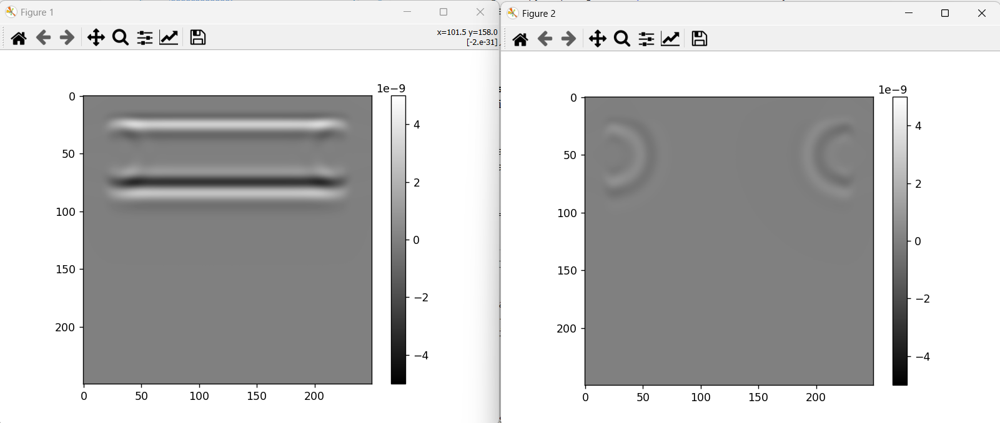

# Eigensimpy

- [Eigensimpy](#eigensimpy)
  - [Introduction](#introduction)
  - [Get Started](#get-started)
  - [Features](#features)
  - [Related Works](#related-works)
  - [Future Work](#future-work)
  - [References](#references)


## Introduction
This package is a Python implementation of a finite difference time domain simulation of ultrasound propagation.

At the current stage, this is not meant to provide a full library for simulations but rather demonstrate the principles and a first implementation in Python. 

## Get Started
The simplest way to get started is to run the script in 

```
...\eigensimpy\eigensimpy\ussim\example.py
```

Two figures will appear which will show a plane wave propagating from the top to the bottom.



The two figures show the particle velocity at a given time. Figure 1 shows the velocity change in the y-direction (vertical), and Figure 2 shows the velocity in the x-direction (horizontal).

## Features
The simulation framework supports Perfectly matched layers and heterogenous anisotropic materials. Each pixel in the grid can be defined as an emitter or receiver.  

## Related Works
There are several other packages in various languages (e.g., MATLAB, C++). The work of Eigensimpy was mostly inspired by the work of Bossy and Grimal[1], which led to [Sim Sonic](http://www.simsonic.fr/), a finite difference time domain solver in C combined with a simple MATLAB toolbox. Another inspiration came from [k-Wave](http://www.k-wave.org/), a MATLAB toolbox for simulating time-resolved ultrasound propagation similar to Eigensimpy. However, k-Wave is pseudospectral based instead of finite difference time domain. The toolbox was developed by Treeby and Cox[2].

The theory was established by Virieux[3] in 1986 and is based on a staggered grid solution. Some of the solvers were directly modeled after that paper and are therefore called with the same name alias (e.g., 'VirieuxDerivViscous2D').

More details can also be found in the [Dissertation by Dr. Daniel Rohrbach](docs/rohrbach.pdf).


## Future Work
Future versions should include a C++ solver with support for GPU processing to add speed to the simulation.

## References
[1] Bossy E, Grimal Q. Numerical Methods for Ultrasonic Bone Characterization, Bone Quantitative 
Ultrasound. In: Laugier P, Haïat G, ed. Springer Netherlands, 2011. pp. 181-228.  

[2]: Treeby BE, Cox BT. k-Wave: MATLAB toolbox for the simulation and reconstruction of 
photoacoustic wave fields. Journal of biomedical optics 2010a;15:021314.

[3]: Virieux J. P-SV wave propagation in heterogeneous media: Velocity-stress finite-difference method. *Geophysics* 1986;51.

